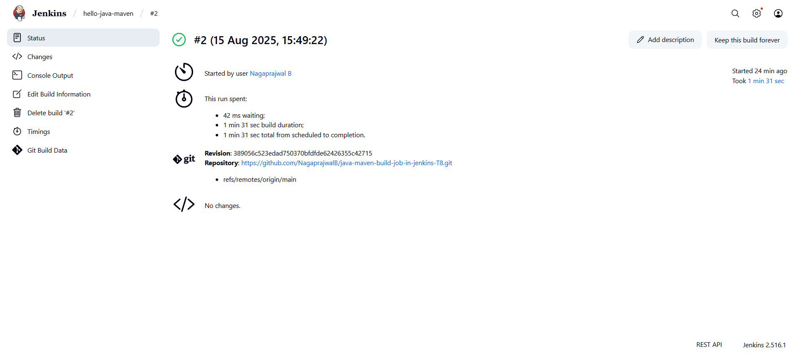
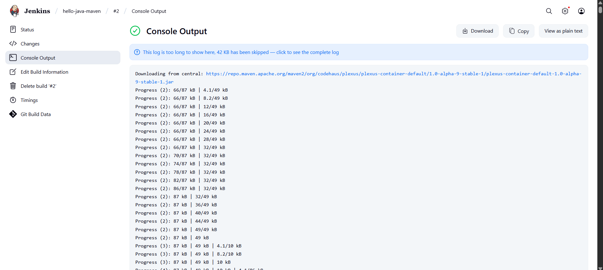
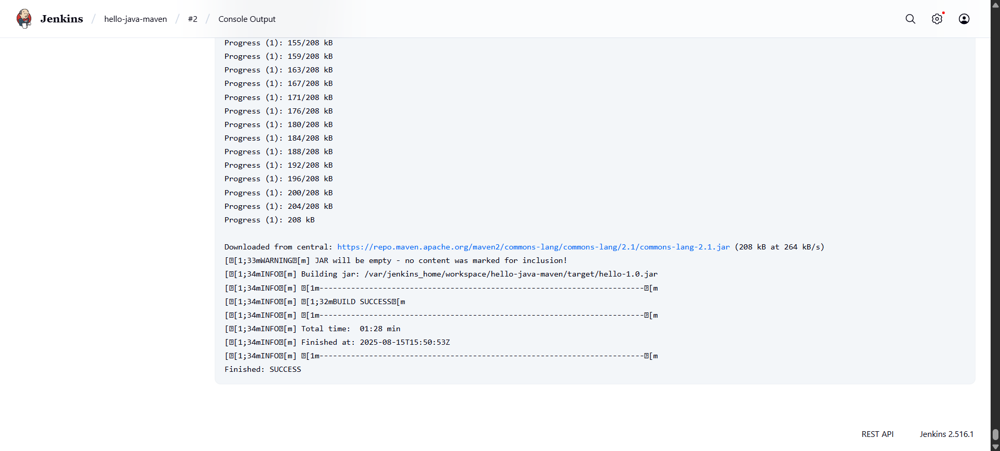

# Hello Java Maven + Jenkins Example

This project demonstrates how to use Jenkins to build a simple Java application with Maven, introducing you to the essentials of CI/CD pipelines.

## 🚀 Objective
* Learn how to create a Java HelloWorld app
* Configure Jenkins to run a Maven build job
* See your first successful CI build

## 📦 Project Structure

```
hello-java-maven/
├── src/
│   └── main/
│       └── java/
│           └── HelloWorld.java
└── pom.xml
```
## 🪄 Prerequisites
* Java JDK 8 or 11
* Maven
* Jenkins (locally or via Docker)
* Git (optional)

## 🛠️ Setup Guide

**1. Clone or Download the Repo**

```
git clone https://github.com/yourusername/hello-java-maven.git
cd hello-java-maven
```
(Or create the files manually as per below)

**2. Create the Java App**

src/main/java/HelloWorld.java:

```
public class HelloWorld {
    public static void main(String[] args) {
        System.out.println("Hello, Jenkins + Maven!");
    }
}
```
**3. Create pom.xml**

```
<project xmlns="http://maven.apache.org/POM/4.0.0"
         xmlns:xsi="http://www.w3.org/2001/XMLSchema-instance"
         xsi:schemaLocation="http://maven.apache.org/POM/4.0.0
                             http://maven.apache.org/xsd/maven-4.0.0.xsd">
    <modelVersion>4.0.0</modelVersion>
    <groupId>com.example</groupId>
    <artifactId>hello</artifactId>
    <version>1.0</version>
    <build>
        <plugins>
            <plugin>
                <groupId>org.apache.maven.plugins</groupId>
                <artifactId>maven-compiler-plugin</artifactId>
                <version>3.8.1</version>
                <configuration>
                    <source>1.8</source>
                    <target>1.8</target>
                </configuration>
            </plugin>
        </plugins>
    </build>
</project>
```
**4. Start Jenkins (Example using Docker)**
```
docker run -p 8080:8080 jenkins/jenkins:lts
```
* Access Jenkins: http://localhost:8080

**5. Configure Maven & Java in Jenkins**
* Go to: Manage Jenkins → Global Tool Configuration
  * Add JDK: (Set JAVA_HOME)
  * Add Maven (e.g., Maven 3.8.6)
  
**6. Create Jenkins Freestyle Job**
* Click: "New Item" → "Freestyle project"
* Source: point to your local repo or checkout via Git
* Build section:
  * Add step: "Invoke top-level Maven targets"
  * Set Goals:
    ```
    clean package
    ```
* Save & click Build Now

**7. Check Console Output**
* Should see:
```
BUILD SUCCESS
```
* The compiled jar file will be in target/

## 🎯 Result

* Java app built and tested by Jenkins/Maven!
* Build status & console log available in Jenkins UI

## Console Output 

```
[INFO] BUILD SUCCESS
[INFO] ------------------------------------------------------------------------
[INFO] Total time:  01:28 min
[INFO] Finished at: 2025-08-15T15:50:53Z
[INFO] ------------------------------------------------------------------------
Finished: SUCCESS
```
## Screenshots

### Build Status 

### Console output 1

### Console output 2



## Happy Building! 🚀